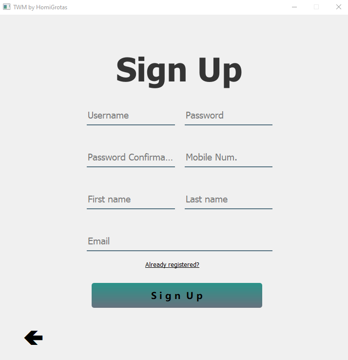

# TWM
## 2021 Summer project
Talk With Me - online chat

This project is an online chat with ability to handle multiple clients
and transfer messages in real time. The goal of the project is to prepare ourselves to the
final project of 12th grade

### Technologies
* sockets
* threading
* sqlite db
* pyqt5, pyqt5 editor
* git (first time using commit, push and different branches)
* AES encryption
* select

### Programming languages used
* Python
* SQL

### Env. Variables
* client: AES_PUBLIC_KEY - 16 digits key
* server: 
  * AES_PUBLIC_KEY - same as the client's key
  * MAIL_ADDRESS - for sending emails to clients
  * MAIL_PASSWORD

### Starting the project using cmd
#### Server
```
set AES_PUBLIC_KEY={16 sigits key}
set MAIL_ADDRESS={your email address}
set MAIL_PASSWORD={your email password}
set PYTHONPATH={path to project directory}
python server/main.py
```

#### Client (after configuring the server)
```
python client/main.py
```

### Windows
* #### Log In


*  #### Sign Up


*  #### Forgot Password


* ####  Lobby


*  #### Chat Rooms

